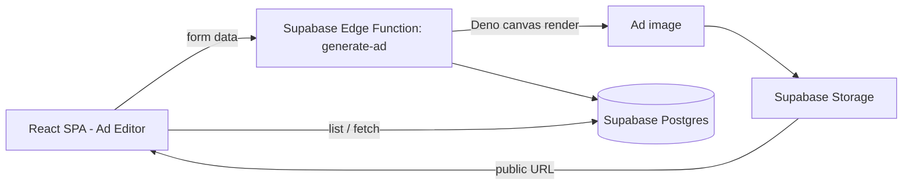

# Dynamic Ad Designer

**A web app for designing and generating platform-specific ad creatives — pick a template, style, language and platform, and export ready-to-run ad images.**

      

> **Note:** Published as a clean, single-commit snapshot.

---

## 🎯 Overview

Producing ad creatives at scale means recreating the same design across platforms, languages, and sizes by hand. Dynamic Ad Designer turns that into a form-driven workflow: the user picks a template style, platform, language, and content, previews the creative live, and generates a finished ad image that's stored and listed in a gallery.

The frontend is a React single-page app; a Supabase backend handles persistence, storage, and server-side image rendering through Deno edge functions.

## ✨ Key Features

- **Template-driven ad editor** — choose a template style, platform, and language, edit copy and imagery, and preview the result live (`AdEditor`, `AdPreview`, `AdTemplateCard`).
- **Platform & language targeting** — `PlatformSelector` and `LanguageSelector` tailor the creative to the destination and locale (including RTL text).
- **Typography & style control** — font selection and template-style pickers for on-brand output.
- **Server-side image generation** — a Supabase Edge Function (`generate-ad`) renders the final ad image on the server using a Deno canvas, then stores it via a `StorageManager`.
- **Generated-ads gallery** — finished creatives are persisted and listed for re-use and download (`GeneratedAdsList`).
- **Custom dialog utilities and focus handling** — shared helpers for dialog behavior and focus management across the UI.

## 🏗️ Architecture



- **Frontend** — React + Vite + TypeScript, shadcn/ui (Radix) components, Tailwind CSS.
- **Backend** — Supabase: Postgres (ad records), Storage (rendered images), and Deno Edge Functions (`generate-ad`, `create_storage_policy`).
- **Rendering** — server-side canvas rendering so exported creatives are pixel-consistent regardless of the client.

## 🧰 Tech Stack

| Layer | Technology |
|-------|------------|
| Frontend | React 18, TypeScript, Vite |
| UI | Tailwind CSS, shadcn/ui (Radix UI), lucide-react |
| Backend | Supabase (PostgreSQL, Storage, Auth) |
| Serverless | Supabase Edge Functions (Deno), `deno canvas` |
| State / data | TanStack Query, React Router |

## 🚀 Getting Started

```bash
# 1. Install dependencies
npm install

# 2. Configure Supabase — copy the template and set your own project values
cp .env.example .env
#    VITE_SUPABASE_URL + VITE_SUPABASE_PUBLISHABLE_KEY (the anon key is safe for
#    client use; access is protected by Supabase Row-Level Security).

# 3. Run the dev server
npm run dev
```

Edge functions live under `supabase/functions/` and deploy with the Supabase CLI (`supabase functions deploy generate-ad`).

## 📁 Project Structure

```
dynamic-ad-designer/
├── src/
│   ├── components/            # AdEditor, AdForm, AdPreview, selectors, gallery, ui/
│   ├── pages/                 # Index (main app)
│   ├── integrations/supabase/ # Supabase client (env-driven)
│   └── utils/                 # logger, accessibility helpers
├── supabase/
│   ├── functions/generate-ad/ # server-side ad image rendering (Deno)
│   └── functions/create_storage_policy/
└── .env.example
```

## License

Released under the [MIT License](LICENSE). Built as a personal portfolio project.
